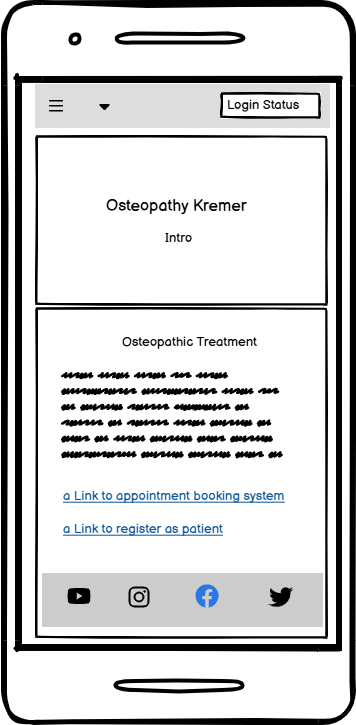
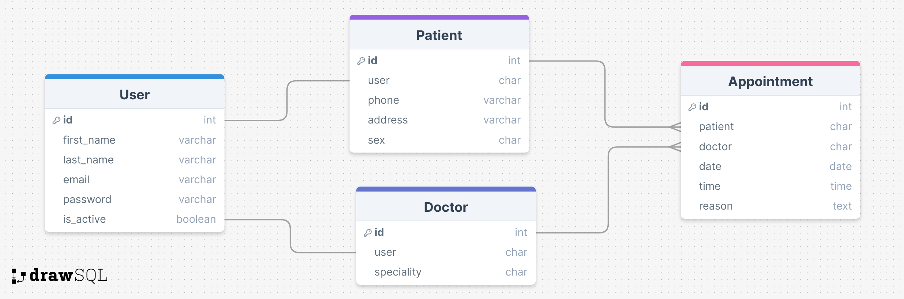

# Osteopathy Patient Booking System

The Osteopathy Patient Booking System is web app for rquesting and scheduling Osteopathy appointment between Doctor and Patient. 

The live app can be accessed here - [Osteopathy Patient Booking System](https://pp4patbook-9453e2a559a6.herokuapp.com/)

Admin access: [Patient Booking Admin](https://pp4patbook-9453e2a559a6.herokuapp.com/admin/login/?next=/admin/)

## Table of Contents

- [Patient Booking System](#patient-booking-system)
  * [User Experience](#user-experience)
    + [User Stories](#user-stories)
    + [Design](#design)
      - [Colours](#colours)
      - [Imagery](#imagery)
      - [Fonts](#fonts)
      - [Wireframes](#wireframes)
  * [Agile Methodology](#agile-methodology)
  * [Data Model](#data-model)
  * [Testing](#testing)
  * [Security Features and Defensive Design](#security-features-and-defensive-design)
    + [User Authentication](#user-authentication)
    + [Form Validation](#form-validation)
    + [Database Security](#database-security)
    + [Custom error pages:](#custom-error-pages-)
  * [Features](#features)
    + [Header](#header)
    + [Footer](#footer)
    + [Home Page](#home-page)
    + [Register Patient Page](#register-patient-page)
    + [Request Appointments](#request-appointments)
    + [Register Doctor](#register-doctor)
    + [Patient Dashboard](#patient-dashboard)
    + [Doctor Dashboard](#doctor-dashboard)
    + [Edit Appointment](#edit-appointment)
    + [Cancel Appointment](#cancel-appointment)
    + [Approve Appointment](#approve-appointment)
    + [Reject Appointment](#reject-appointment)

  * [Deployment - Heroku](#deployment---heroku)
  * [Languages](#languages)
  * [Frameworks - Libraries - Programs Used](#frameworks---libraries---programs-used)
  * [Credits](#credits)
  * [Acknowledgments](#acknowledgments)

## User Experience

The user is patient who want to get brief information about the service. He wants to have the possibility to request and manage Osteopathy appointments. 

### User Stories

#### EPIC | Register Patient
 - As a Patient I can register an account so that I can request/edit/cancel an appointment with a specific doctor.
 - As a Patient I can log in or log out of my account so that I can keep my account secure.
 - As a Patient I can access my Patient Dashboard
 - As a Patient I can see my login status so that I know if I'm logged in or out.

#### EPIC | Register Doctor 
 - As a Doctor I can register as doctor so that I receive and manage (approve, reject or cancel) appointment requests from Patients
 - As a Doctor I can log in or log out of my account so that I can keep my account secure.
 - As a Doctor I can access my doctor dashboard
 - As a Doctor I can see my login status so that I know if I'm logged in or out.

#### EPIC | Manage Appointments as Patient
 - As a Patient I can create and submit appointment requests so that I can create appointments with specific doctors.
 - As a Patient I can edit existing appointments and appointment request so that I can change date, time and reason for my appointment.
 - As a Patient I can cancel appointment requests and approved appointments so that I can cancel appointments when I don´t need them anymore.

#### EPIC | Mangae Appointments as Doctor 
 - As a Doctor I can approve appointment requests so that I can confirm an appointment to a patient.
 - As a Doctor I can reject appointment request so that I can tell the patient that he needs to suggest another date and time.
 - As a Doctor I can cancel an already answered appointment request when I cannot attend them.

#### EPIC | Patient Dashboard
 - As a Patient I can access my Patient Dashboard
 - As a Patient I can view my Patient details on Patient Dashboard
 - As a Patient I can view my appointment requests and my approved, rejected and canceled appointments on Patient Dashboard

#### EPIC | Doctor Dashboard
 - As a Doctor I can access my Doctor Dashboard
 - As a Doctor I can view my Doctor details on Doctor Dashboard
 - As a Doctor I can view my appointment requests and my approved, rejected and canceled appointments on Doctor Dashboard

#### EPIC | User Navigation 
 - As a Site User I can easily understand the Use Case of the site 
 - As a Site User I can intuitively navigate on the site and find the content and functionality I´m looking for 
 - As a Site User (Doctor or Patient) I can view the respective dashboard and view a paginated list of appointment requests and appointments

#### Not implemented User Stories 
 - As a patient or doctor I can edit my user details 
 - As a doctor I can enter my availabilities to show my patients when I have available appointments 
 - As patient I can view available time slots in a calender view for each doctor 

### Design

The page has a very simple design. Focus lies on the functionality and providing basic information to the patients. 

#### Colour 

The colours should have a clear expression. A colour should appear repeatedly. For example the blue from the buttons, appears in the menus and login status. 

#### Wireframes

Wireframes were created with Balsamiq.

Desktop Wireframe - Home Login

Desktop Wireframe - Home Logout

Desktop Wireframe - Dashboard

Wireframe - Mobile View Home

## Agile Methodology

Github projects was used to manage agile development. The project be found here: [Github project](https://github.com/users/clekremer/projects/6)

Epics from User Eperience chapter were used as Milestones. For User Storie I created a template as Github Issue. User stories were linked with it´s parent Epic. In User stories acceptance criteria are defined, which needed to be fulfilled in order to complete the user story. Labels were used to define priority of implementation (must have, nice to have, not implemented). Iterations were used to work in a sprint based approach. Bugs and New Features were indicated as GitHub issues. 

## Data Model

To cover the principles of object-based software development a decent and custom data model was used to fit the project purpose. 

The diagram shows how the elements are related to eachother. 
 - A User can be a one patient or one doctor or one patient and one doctor 
 - The relation between Patient and Doctor to appointment is a one to many relation
 - The appointment is linked to patient and doctor by foreign keys  

## Testing
Testing document and the testing results can be found [here](/TESTING.md)

## Security Features and Defensive Design

### User Authentication

To use the booking system the User needs to register first as Patient or as Doctor or as both. So the system is protected by an authentication system. 
After registration the User is able to login and has the permission to view his data and book, edit and cancel appointments.

The authentication system based on the following implementation:
- auth app added to the list installed Django apps
- auth and login urls
- registration link on navbar and home page
- login and logout links to navbar
- customised register patient form and register doctor forms in HTML templates
- customised login, logout HTML templates
- notification messages for registration, login and logout

### Form Validation
Empty or incorrect data cannot not be submitted in any form. I this case a notification will appear to inform the user which kind of data he has to add or change. 

### Database Security
CSRF tokens were used for all forms on this site. 

Database url and secret key were added in the .env file to ensure  the database security. 

## Features

### Header / Navigation Bar 

 - the navigation bar is visible on every page 
 - Users which are not logged in will see this view:
 

 - In this case they have the possibility to log in or the register as a new patient or doctor 

 - Users which are logged in will see this view:
 

 - A User who is registered as Patient has the possibility to access the Patient Dashboard and Book Appointments form
 - A User who is registered as doctor has the possibility to access the Doctor Dashboard 
 - A User who is registered as doctor and as patient has access to both dashboards

 - A hover effect indicates which nav item is currently selected
 - A login status indicates if a user is currently logged in or not

### Footer

 - In the footer there are links to Facebook, Instagram, Twitter and Youtube
 - By clicking on the links in the footer the user is redirected to the respective social media page in a separate tab 

### Home Page

 - On the Home page basic information about site is presented 
 - On the intro section information about the osteopathy practice is presented 
 - On the treatment section information about osteopathic treamtent is presented 
 - Below these section the user find links to book an appointment (if he is already logged in); if he is not logged in he gets redirected to the login form 
 - Another link is for users who User who not yet registered as patient. In this cases they got redirected to the registration page

### Register Patient Page

 - The Register Patient Page is a simple form to enter patient details
 - By clicking register button he is registered as patient
 - Afterwards he has access to patient dashboard and the book appointments form 

### Book Appointment

 - On Book Appointment page a Patient can use the book appointment form the request an appointment
 - The patient can select the doctor and enter the favorable time and date and the reason for his visit
 - After clicking on "book" button an appointment request is created an submitted to the selected doctor

### Register Doctor
 - By clicking on Register Doctor the user is getting redirected to admin login page
 - Only admin user have the permission to register a new doctor:
 
 - After entering the admin credentials 
 - There are two possibilities to register a new doctor: 1. Register New User as Doctor 2. Register Existing User as Doctor:
 
 
 - By clicking 1. Register New User as Doctor a form is displayed to enter all data for a new user and the speciality of the doctor
 
 - By clicking 2. Register Existing User as Doctor a list of existing user is displayed and a field to enter the speciality 
 

### Patient Dashboard

- On Patient Dashbaord the patient details are displayed
- Furthermore the Patient can view his appointment requests and his approved, rejected and canceled appointments 
- Existing appointment requests and appointments can be managed here 

### Doctor Dashboard

- On Doctor Dashbaord the doctor can view, approve or reject appointment requests 
- Existing appointments can be canceled here as well 

### Edit Appointment

- As a Patient I can edit existing appointments and appointment request so that I can change date, time and reason for my appointments
- On patient dashboard patients can view their appointments and click on edit button in order to modify date, time and reason
- After clicking save changes button the appointments are moved in pending status again, so that a doctor has to answer on them again
- A notifcation appears that the appointment was updated successfully

### Cancel Appointment
#### Cancel Appointment as a Patient

 - As a Patient I can cancel 'appointment requests' and 'approved appointments', so that I cancel appointments when I don´t need them anymore
 - On patient dashboard a patient can view approved and pending appointments
 - By clicking on cancel button he can cancel them
 - A notification appears that the appointment was cancelled successfully
 - cancelled appointments are move to the cancelled appointments table

#### Cancel appointment as a doctor

 - As a Doctor I can cancel an already answered appointment request when I cannot attend them.
 - On doctor dashboard a doctor can view answered appointment requests
 - By clicking on cancel button he can cancel them
 - A notification appears that the appointment was cancelled successfully
 - Cancelled appointments are move to the cancelled appointments table on patient dashboard

### Approve Appointment

 - As a Doctor I can approve appointment request so that I can confirm an appointment to a patient.
 - On doctor dashbaord a doctor can view pending appointment requestsb by selecting "approve" status and clicking on update button he can approve an appointment requests
 - A notification appears that the appointment was approved successfully
 - An updated appointment request is move into the answered appointment request list

### Reject Appointment

 - As a Doctor I can reject appointment request so that I can tell the patient that he needs to suggest another date and time.
 - On doctor dashbaord a doctor can view pending appointment requests by selecting "reject" status and clicking on update button he can reject an appointment request
 - A notification appears that the appointment was rejected successfully
 - An updated appointment request is move into the answered appointment request list

## Deployment - Heroku
The was deployed on Heroku by the following steps: 

### Create the Heroku App:
- Log in to [Heroku](https://dashboard.heroku.com/apps) 
- click button "Create New App"
- Enter a unique app name
- Select region (Europe)
- Click "Create App" button

### Setting tab:
- add DATABASE_URL in the Config Vars 
- add DISABLE_COLLECTSTATIC = 1 in the Config Vars 

### Prepare the .env and settings.py file:
- In GitPod workspace, create an .env file 
- Add the DATABASE_URL value and SECRET_KEY value to the .env file 
- Update the settings.py to import the .env file and add SECRETKEY and DATABASE_URL file paths
- Comment out the default database configuration
- Save files and make migrations
- Add the STATIC files settings - the url, storage path, directory path and root path 
- Add Heroku to the ALLOWED_HOSTS list the format ['app_name.heroku.com', 'localhost']

### Create files / directories
- Create requirements.txt file
- Create a file named "Procfile" in the main directory and add the following: web: gunicorn project-name.wsgi

### Deploy
- Ensure in Django settings, DEBUG is False
- Go to the deploy tab on Heroku and connect to the GitHub project 
- deploy the app by Automatic Deploys or deploy it manually
- Click View or open app button to load the deployed site.

## Languages
- Python
- HTML
- CSS
- Javascript

## Frameworks - Libraries - Programs Used
- [Django](https://www.djangoproject.com/): Framework to develop the app.
- [Heroku](https://dashboard.heroku.com/login) Cloud based platform for deployment of the app. 
- [Font Awesome](https://fontawesome.com/) Icons. 
- [GitHub](https://github.com/) Repository, version control and agile tool.
- [Google Fonts](https://fonts.google.com/) Fonts
- [W3C](https://www.w3.org/) Validation of HTML & CSS
- [PEP8 Online](http://pep8online.com/) Validation of Python code
- [Jshint](https://jshint.com/) Validation of javascript
- [Stack Overflow](https://stackoverflow.com/)
- [Update View](https://pytutorial.com/django-updateview-example)

## Acknowledgments

Special thanks to Kristyna for all your support, kindness, availability and positive attitude!

