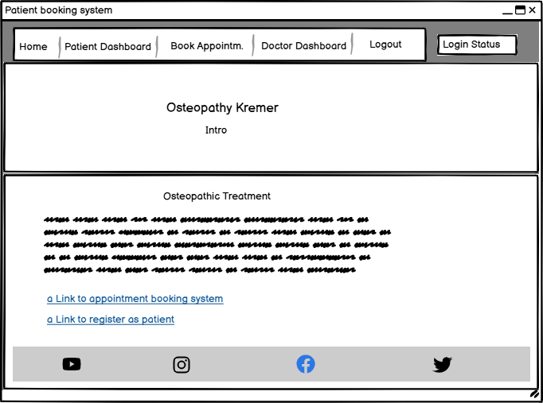
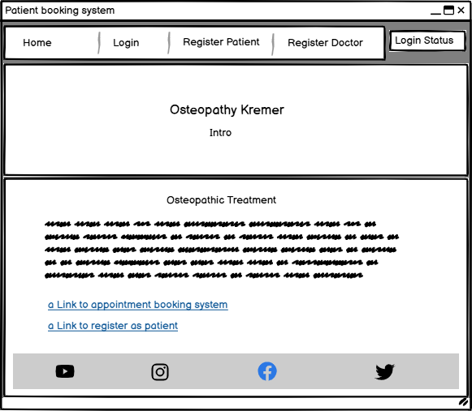
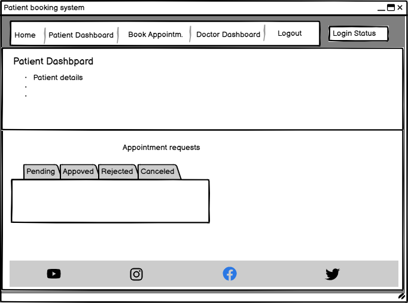

# Osteopathy Patient Booking System

The Osteopathy Patient Booking System is web app for rquesting and scheduling Osteopathy appointment between Doctor and Patient. 

The live app can be accessed here - [Osteopathy Patient Booking System](https://pp4-pbooking-ea6d40f1e5c0.herokuapp.com/)

## Table of Contents

- [Patient Booking System](#patient-booking-system)
  * [User Experience](#user-experience)
    + [User Stories](#user-stories)
    + [Design](#design)
      - [Colours](#colours)
      - [Imagery](#imagery)
      - [Fonts](#fonts)
      - [Wireframes](#wireframes)
  * [Agile Methodology](#agile-methodology)
  * [Data Model](#data-model)
  * [Testing](#testing)
  * [Security Features and Defensive Design](#security-features-and-defensive-design)
    + [User Authentication](#user-authentication)
    + [Form Validation](#form-validation)
    + [Database Security](#database-security)
    + [Custom error pages:](#custom-error-pages-)
  * [Features](#features)
    + [Header](#header)
    + [Footer](#footer)
    + [Home Page](#home-page)
    + [Register Patient Page](#register-patient-page)
    + [Request Appointments](#request-appointments)
    + [Register Doctor](#register-doctor)
    + [Patient Dashboard](#patient-dashboard)
    + [Doctor Dashboard](#doctor-dashboard)
    + [Edit Appointment](#edit-appointment)
    + [Cancel Appointment](#cancel-appointment)
    + [Approve Appointment](#approve-appointment)
    + [Reject Appointment](#reject-appointment)

  * [Deployment - Heroku](#deployment---heroku)
  * [Languages](#languages)
  * [Frameworks - Libraries - Programs Used](#frameworks---libraries---programs-used)
  * [Credits](#credits)
  * [Acknowledgments](#acknowledgments)

## User Experience

The user is patient who want to get brief information about the service. He wants to have the possibility to request and manage Osteopathy appointments. 

### User Stories

#### EPIC | Register Patient

#### EPIC | Register Doctor 

#### EPIC | Manage Appointments as Patient

#### EPIC | Mangae Appointments as Doctor 

### Design

The page has a very simple design. Focus lies on the functionality and providing basic information to the patients. 

#### Colour 

#### Imagery

#### Fonts

#### Wireframes

Desktop Wireframe

## Agile Methodology

Github projects was used to manage agile development.

## Data Model

## Testing

## Security Features and Defensive Design

### User Authentication

### Form Validation

### Database Security

### Custom error pages

## Features

### Header

### Footer

### Home Page

### Register Patient Page

### Request Appointment

### Register Doctor

### Patient Dashboard

### Doctor Dashboard

### Edit Appointment

### Cancel Appointment

### Approve Appointment

### Reject Appointment

## Deployment - Heroku

The was deployed on Heroku by the following steps: 

## Languages

- Python
- HTML
- CSS
- Javascript

## Frameworks - Libraries - Programs Used
- [Django](https://www.djangoproject.com/): Framework to develop the app.
- [Heroku](https://dashboard.heroku.com/login) Cloud based platform for deployment of the app. 
- [Font Awesome](https://fontawesome.com/) Icons. 
- [GitHub](https://github.com/) Repository, version control and agile tool.
- [Google Fonts](https://fonts.google.com/) Fonts
- [W3C](https://www.w3.org/) Validation of HTML & CSS
- [PEP8 Online](http://pep8online.com/) Validation of Python code
- [Jshint](https://jshint.com/) Validation of javascript
- [Stack Overflow](https://stackoverflow.com/)
- [Update View](https://pytutorial.com/django-updateview-example)

## Acknowledgments

