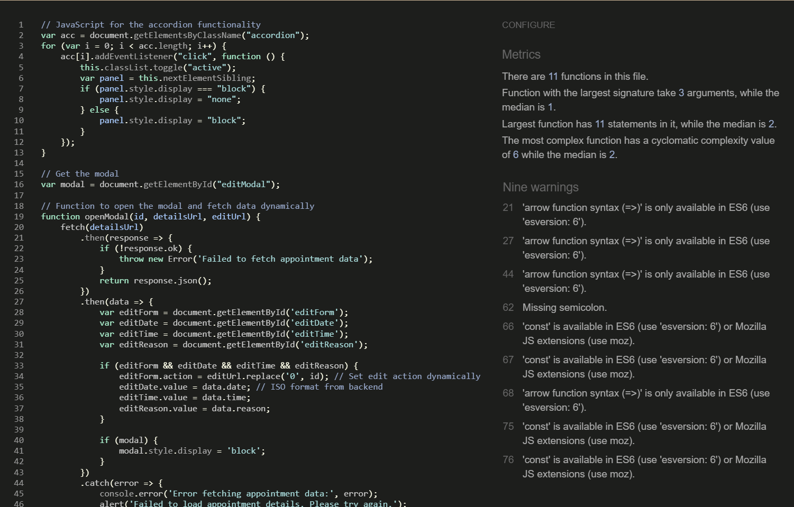

# Table of Contents
- [User Story Testing](#user-story-testing)
- [Validator Testing](#validator-testing)
  * [HTML](#html)
  * [CSS](#css)
  * [Javascript](#javascript)
  * [Python](#python)
  * [Lighthouse](#lighthouse)
- [Browser Testing](#browser-testing)
- [Device Testing](#device-testing)
- [Manual Testing](#manual-testing)
- [Bugs](#bugs)

## User Story Testing

### EPIC - Register Patient

As a Patient I can register an account so that I can create/edit/cancel appointment requests and appointments with a doctor.

A register patient nav menu item is visible on the Homepage. When the user clicks it he is taken to the register patient page.

After registration the Patient he is able to log in and log out in his account, view his details on patient dashboard and manage appointments.

Furthtermore he can always see his login status, to let him know if he is logged in or not. 

### EPIC - Register Doctor

As a Doctor I can register an account so that I can approve/reject/canel appointment requests and appointments with a patient.

A register doctor nav menu item is visible on the Homepage. When the user clicks it he has to enter admin credentials and afterwards he is taken to the register doctor page.

From here there are 2 options to register: 1. Register a new user as Doctor; 2. Register an existing user as doctor

After registration the Doctor he is able to log in and log out in his account, view his details on doctor dashboard and manage appointments.

Furthtermore he can always see his login status, to let him know if he is logged in or not.

### EPIC - Nav Menu

As a site User you have a minimum of actions to interact with the web site. On the landing page some information about Osteopathy is presented. Afterwards there is a direct link to book an appointment or to register as patient, in order to book an appointment afterwards. As a site owner or employee it´s quite clear that you need to register as a doctor in order to answer to appointent requests. 

In the nav menu the site user only finds all relevant information about the practice on the landing page. If he already has an account he can login and access his dashbaord. The dashboard is only visible for user who are logged in. The same is for the doctor dashboard. 

It´s always visible to the user if he is logged in or not. 

### EPIC - Patient Dashbaord

After registration as patient, the user gets access to the patient dashboard. Here he can view his patient details and manage his appointment requests and appointments.

### EPIC - Doctor Dashbaord

After registration as docotr, the user gets access to the doctor dashboard. Here he can view his doctor details and manage  appointment requests and appointments.

### EPIC - Manage appointments as Patient

After login as patient the user can find an option to book appointments in the nav menu. By clicking on book appointment he is taken to book appointment page. Here he can enter his favorable date and time and reason for his visit. 

Once an appointment request is submitted any appointment request and answered appointment can be managed on patient dashbaord. 

Here the patient has the possibility to edit or cancel appointments. 

### EPIC - Manage appointments as Doctor

After login as doctor the user has access to the doctor dashbaord. 
Once an appointment request was sent by a patient to a dctor it will be displayed on the doctor dashboard.  

Here the doctor has the possibility to react on the appointment request. He can reject, approve or cancel appointments.

## Validator Testing

### HTML

The HTML pages were tested with [W3C HTML Validator](https://validator.w3.org/). with the following results:

### CSS

No errors were found by testing the CSS file with [W3C CSS Validator](https://jigsaw.w3.org/css-validator/)

### Javascript

No errors were found by testen the js file with [Jshint](https://jshint.com/) 

### Python

No errors were found by testing all python files with [Pep8](http://pep8online.com/).

### Lighthouse

## Browser testing 

## Device Testing / Responsivenes

## Manual Testing

### Site Navigation

### Register patient

### Register doctor

### Login

### Book appointment

### Manage appointments as patient

### Manage appointments as doctor

## Bugs

