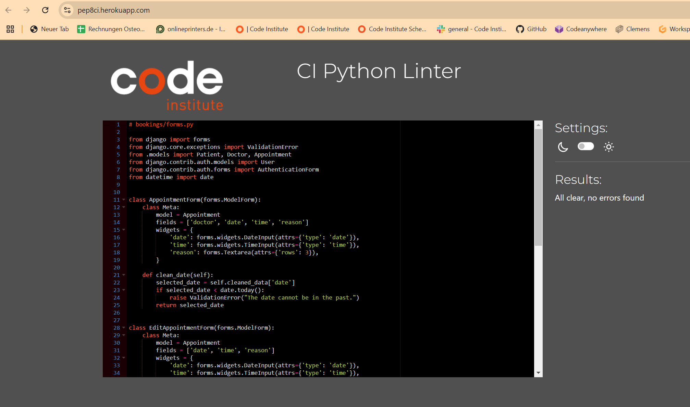

# Table of Contents
- [User Story Testing](#user-story-testing)
- [Validator Testing](#validator-testing)
  * [HTML](#html)
  * [CSS](#css)
  * [Javascript](#javascript)
  * [Python](#python)
  * [Lighthouse](#lighthouse)
- [Browser Testing](#browser-testing)
- [Device Testing](#device-testing)
- [Manual Testing](#manual-testing)
- [Bugs](#bugs)

## User Story Testing

### EPIC - Register Patient

As a Patient I can register an account so that I can create/edit/cancel appointment requests and appointments with a doctor.

- [x] A register patient nav menu item is visible on the Homepage. When the user clicks it he is taken to the register patient page.

- [x] After registration the Patient he is able to log in and log out in his account, view his details on patient dashboard and manage appointments.

- [x] Furthtermore he can always see his login status, to let him know if he is logged in or not. 

*USER STORY: Login & Logout - As a User, I can log in or log out in my account so that I can authenticate myself.*

Acceptance Criteria logged-out user:
a. Log in option on the nav bar.
b. By clicking login I should be taken to the log-in page.
c. After entering the credentials and clicking login I should be logged in.
d. A notificaiton should appear to confirm that I have been logged in successfully.
e. If I enter the incorrect credentials I should receive feedback on what information was incorrectly entered.

Acceptance Criteria logged in user
a. When user clicks log out button he is getting logged out
b. A notification appears that he has been logged out successfully.

Tasks:

Install auth and add to installed apps
Add auth urls
Add log in and log out links to navbar
Customise login, logout HTML templates
Create success messages for successful login/logout

*User story: User Registration - As a Site User (Patient) I can register an account so that I can book/edit/cancel appointments.*

Acceptance Criteria:
a. A register menu or link should be visible on the homepage.
b. After clicking the menu / link the user should be taken to the register page.
c. After filling in the details and clicking register button a new account should be created.
d. I should then be notified that I have been logged in.

Tasks:

Install auth app and add to installed apps
Add register link to navbar and home page
Customise register patient form to HTML templates
Create message to notify user of successful registered

### EPIC - Register Doctor

As a Doctor I can register an account so that I can approve/reject/canel appointment requests and appointments with a patient.

- [x] A register doctor nav menu item is visible on the Homepage. When the user clicks it he has to enter admin credentials and afterwards he is taken to the register doctor page.

- [x] From here there are 2 options to register: 1. Register a new user as Doctor; 2. Register an existing user as doctor

- [x] After registration the Doctor he is able to log in and log out in his account, view his details on doctor dashboard and manage appointments.

- [x] Furthtermore he can always see his login status, to let him know if he is logged in or not.

*USER Story: Register Doctor - As a Doctor I can register as doctor so that I receive acces to the doctor dashboard to manage appointment requests.*

Acceptance Criteria:
a. A register doctor buttion should be visible on the nav bar

b. By clicking this button the user needs to enter admin credentials, so that only admin user are allowed to register new doctors

b. After successfully authentication as admin there should appear two possible authentication flows: 1. Register new User as a Doctor & 2. Register existing User as Doctor

c. Register new User as a Doctor:
   - a new user is created by entering all new user details
d. Register existing User as as Doctor:
   - an existing user can be selected and registered as a doctor

d. in both cases a notification should appear that registration was successful

### EPIC - Home Page / Nav Menu

As a site User you have a minimum of actions to interact with the web site. On the Home Page some information about Osteopathy is presented. Afterwards there is a direct link to book an appointment or to register as patient, in order to book an appointment afterwards. As a site owner or employee it´s quite clear that you need to register as a doctor in order to answer to appointent requests. 

If he already has an account he can login and access his dashbaord. The dashboard is only visible for user who are logged in. The same is for the doctor dashboard. 

It´s always visible to the user if he is logged in or not. 

### EPIC - Patient Dashbaord

- [x] As a Patient I can access my Patient Dashboard
- [x] As a Patient I can view my Patient details on Patient Dashboard
- [x] As a Patient I can view my appointment requests and my approved, rejected and canceled appointments on Patient Dashboard

*User story: View Patient details - As a Patient I can view my patient details on patient dashboard*

Acceptance Criteria:
a. After login and authentication as patient I have access to my patient dashboard
b. I can view my patient details: Username, Address, Email, Phone, Sex
c. I can view my appointment requests and my approved, rejected and canceled appointments on Patient Dashboard

*User story: View appointments as a patient - As a patient I can view the status of all my appointment requests and appointments.*

Acceptance Criteria
a. After login as patient I have access to patient dashboard
b. On Patient dashboard I can view my appointment requests and appointments listed per status (cancelled, rejected, approved)
c. On each appointment find details about data, time, doctor and reason

NOT IMPLEMENTED 
*User Story: Edit patient details - As a Patient I can edit my patient details on patient dashboard so that I can add any changes in my details.*

Acceptance Criteria:
a. On patient dashboard I can view my details
b. The details are editable and I can save the changes by clicking save button
c. After clicking save button a control flag appears, which is asking the user if he really wants to change his details
d. After successfully changing the details a success notification appears

### EPIC - Doctor Dashbaord

- [x] After registration as docotr, the user gets access to the doctor dashboard. 
- [x] Here he can view his doctor details and manage  appointment requests and appointments.

*User story: View doctor details - As a Doctor I can view my doctor details on doctor dashboard*

Acceptance Criteria:
a. After login and authentication as doctor I have access to my doctor dashboard
b. On doctor dashboard I can view my doctor details: Username, Address, Email, Phone, Speciality

*User story: View appointments as doctor - As a doctor I can view appointment requests on doctor dashboard so that I can confirm them to the patients.*

Acceptance Critera:
a. After authentication as doctor I can view doctor dashboard
b. A list of pending appointment requests is displayed
c. A list of answered appointment requests is displayed

NOT IMPLEMENTED
*User Story: Edit doctor details - As a Doctor I can edit my doctor details on doctor dashboard so that I can add any changes in my details.*

Acceptance Criteria:
a. On doctor dashboard I can view my details
b. The details are editable and I can save the changes by clicking save button
c. After clicking save button a control flag appears, which is asking the user if he really wants to change his details
d. After successfully changing the details a success notification appears

### EPIC - Manage appointments as Patient

After login as patient the user can find an option to book appointments in the nav menu. 

- [x] By clicking on book appointment he is taken to book appointment page. Here he can enter his favorable date and time and reason for his visit. 

- [x] Once an appointment request is submitted any appointment request and answered appointment can be managed on patient dashbaord. 

- [x] the patient has the possibility to edit or cancel appointments. 

*User Story: Book Appointment - As a Patient I can create and submit appointment request so that I can create appointments with specific doctors.*

Acceptance Criteria:
a. By clicking on nav menu item book appointment the patient is taken to book appointment page
b. On book appointment page the patient can enter a form with his favorable date and time and select a doctor
c. The patient has to enter all requested fields otherwise he cannot submit the request
d. After successfully submitting the request a notification appears
e. The new created appointment request stays in pending status and is added to the Pending Appointment Requests table

*User Story: Edit Appointment - As a Patient I can edit existing appointments and appointment request so that I can change date, time and reason for my appointment.*

Acceptance Criteria:
a. On patient dashboard patients can view their appointments and click on edit button in order to modify date, time and reason
b. After clicking save changes button the appointments are moved in pending status again, so that a doctor has to answer on them again
c. A notifcation appears that the appointment was updated successfully

*User Story: Cancel Appointment as a Patient - As a Patient I can cancel appointment requests and approved appointments so that I cancel appointments when I don´t need them anymore.*

Acceptance Criteria:
a. On patient dashboard a patient can view approved and pending appointments
b. By clicking on cancel button he can cancel them
c. A notification appears that the appointment was cancelled successfully
c.Cancelled appointments are move to the cancelled appointments table

### EPIC - Manage appointments as Doctor

- [x] After login as doctor the user has access to the doctor dashbaord. 
- [x] Once an appointment request was sent by a patient to a dctor it will be displayed on the doctor dashboard.  
- [x] Here the doctor has the possibility to react on the appointment request. He can reject, approve or cancel appointments.

*User story: Approve appointment - As a Doctor I can approve appointment request so that I can confirm an appointment to a patient.*

Acceptance Criteria:
a. On doctor dashbaord a doctor can view pending appointment requests
b. By selecting "approve" status and clicking on update button he can approve an appointment requests
c. A notification appears that the appointment was approved successfully
d. An updated appointment request is move into the answered appointment request list

*User story: Reject Appointments - As a Doctor I can reject appointment request so that I can tell the patient that he needs to suggest another date and time.*

Acceptance Criteria:
a. On doctor dashbaord a doctor can view pending appointment requests
b. By selecting "reject" status and clicking on update button he can reject an appointment request
c. A notification appears that the appointment was rejected successfully
d. An updated appointment request is move into the answered appointment request list

*User story: Cancel appointment as a doctor - As a Doctor I can cancel an already answered appointment request when I cannot attend them.*

Acceptance Criteria:
a. On doctor dashboard a doctor can view answered appointment requests
b. By clicking on cancel button he can cancel them
c. A notification appears that the appointment was cancelled successfully
d. Cancelled appointments are move to the cancelled appointments table on patient dashboard

## Validator Testing

### HTML

The HTML pages were tested with [W3C HTML Validator](https://validator.w3.org/). with the following results:

### CSS

No errors were found by testing the CSS file with [W3C CSS Validator](https://jigsaw.w3.org/css-validator/)

### Javascript

No errors were found by testen the js file with [Jshint](https://jshint.com/) 

### Python

No errors were found by testing all python files with [Pep8](https://pep8ci.herokuapp.com/).

### Lighthouse

Patient booking system was tested with Chrome Lighthouse testing with the following results:

## Browser testing 

The Website was tested with Chrome, Firefox and Edge browsers. No issues were found.

## Device Testing / Responsivenes

Responsive design was test with chrome dev tools for desktop, mobile and tablet screens. No issues were found:

## Manual Testing

### Site Navigation

| Element               | Action     | Expected Result                                                    | Pass/Fail |
|-----------------------|------------|--------------------------------------------------------------------|-----------|
| NavBar                |            |                                                                    |           | 
| Home Link             | Click      | Redirect to home                                                   | Pass      |
| Login Link            | Click      | Open login page and form                                           | Pass      |
| Register Link         | Click      | Open Register Patient page and form                                | Pass      |
| Register Doctor Link  | Click      | Open Register Doctor page and form                                 | Pass      |
| logout status         | Display    | "You are not logged in" if no user is logged in                    | Pass      |
| Patient Dashboard Link| Click      | Open Patient Dashbaord                                             | Pass      |
| Book Appointment Link | Click      | Open Book Appointment page and form                                | Pass      |
| Doctor Dashboard Link | Click      | Open Doctor Dashbaord                                              | Pass      |
| Logout Link           | Click      | Will logout the current user and opens login page                  | Pass      |
| login status          | Display    | "Welcome, User!" if a user is logged in                            | Pass      |
|                       |            |                                                                    |           |
| Mobile View           |            |                                                                    |           |
| Hamburger Menu        | Responsive | Display when screen size reduces to medium size                    | Pass      |
| Home Link             | Click      | Redirect to home                                                   | Pass      |
| Login Link            | Click      | Open login page and form                                           | Pass      |
| Register Link         | Click      | Open Register Patient page and form                                | Pass      |
| Register Doctor Link  | Click      | Open Register Doctor page and form                                 | Pass      |
| logout status         | Display    | "You are not logged in" if no user is logged in                    | Pass      |
| Patient Dashboard Link| Click      | Open Patient Dashbaord                                             | Pass      |
| Book Appointment Link | Click      | Open Book Appointment page and form                                | Pass      |
| Doctor Dashboard Link | Click      | Open Doctor Dashbaord                                              | Pass      |
| Logout Link           | Click      | Will logout the current user and opens login page                  | Pass      |
| login status          | Display    | "Welcome, User!" if a user is logged in                            | Pass      |
|                       |            |                                                                    |           |
| Footer                |            |                                                                    |           |
| All links             | Click      | Open correct scoial media platform in new tab                      | Pass      |

### Home Page

| Element                           | Action  | Expected Result                        | Pass/Fail |
|-----------------------------------|---------|----------------------------------------|-----------|
| Intro section                     | Display | Display intro about praxis             | Pass      |
| Treatment section                 | Display | Show information about treatment       | Pass      |
| "Appointment booking system" link | Click   | Open Book Appointment page and form    | Pass      |
| "Register here to use ...." link  | Click   | Only visible if user in session        | Pass      |

### Register patient

| Element               | Action                              | Expected                                  | Pass/Fail |
|-----------------------|-------------------------------------| ------------------------------------------|-----------|
|                       |                                     |                                           |           | 
| Register Link         | Click                               | Open Register Patient page and form       | Pass      |
| Username field        | Insert no username + click          | Form won´t submit + notification          | Pass      |
| Username field        | Insert username + click             | Form will submit  + notification          | Pass      |
| Email field           | Insert wrong email + click          | Form won´t submit + notification          | Pass      |
| Email field           | Insert correct email + click        | Form will submit  + notification          | Pass      |
| Password field        | Insert no pw + click                | Form won´t submit + notification          | Pass      |
| Password field        | Insert pw + click                   | Form will submit + notification           | Pass      |
| Phone field           | Insert no value + click             | Form won´t submit + notification          | Pass      |
| Phone field           | Insert value + click                | Form will submit + notification           | Pass      |
| Address field         | Insert no value + click             | Form won´t submit + notification          | Pass      |
| Address field         | Insert value + click                | Form will submit + notification           | Pass      |

### Register doctor

| Element                    | Action                              | Expected                                  | Pass/Fail |
|----------------------------|-------------------------------------| ------------------------------------------|-----------|
|                            |                                     |                                           |           | 
| Register Doctor Link       | Click                               | Open admin login page                     | Pass      |
| Username field             | Insert no admin username + click    | Form won´t submit + notification          | Pass      |
| Username field             | Insert admin username + click       | Form will submit  + notification          | Pass      |
| Password field             | Insert no admin pw + click          | Form won´t submit + notification          | Pass      |
| Password field             | Insert admin pw + click             | Form will submit + notification           | Pass      |
|                            |                                     |                                           |           |
|Register Doctor Step1       |                                     |                                           |           |  
|Proceed next step           | Click                               | Open Register Doctor Step2                | Pass      |
|                            |                                     |                                           |           |
|Register Doctor Step2       |                                     |                                           |           |
|Register New User as Doctor | Click                               | Open Register New User as Doctor Page     | Pass      |
|Register Existing User...   | Click                               | Open Register Existing User as Doctor Page| Pass      |
|                            |                                     |                                           |           |  |Register New User as Doctor |                                     |                                           |           |  
| Username field             | Insert no username + click          | Form won´t submit + notification          | Pass      |
| Username field             | Insert username + click             | Form will submit  + notification          | Pass      |
| Email field                | Insert wrong email + click          | Form won´t submit + notification          | Pass      |
| Email field                | Insert correct email + click        | Form will submit  + notification          | Pass      |
| Password field             | Insert no pw + click                | Form won´t submit + notification          | Pass      |
| Password field             | Insert pw + click                   | Form will submit + notification           | Pass      |
| Speciality field           | Insert no value + click             | Form won´t submit + notification          | Pass      |
| Speciality field           | Insert value + click                | Form will submit + notification           | Pass      |
|                            |                                     |                                           |           | 
|                            |                                     |                                           |           | 
| Register Existing User..   |                                     |                                           |           |  
| Select User field          | Select user                         | Form will submit + notification           | Pass      |
| Speciality field           | Insert no value + click             | Form won´t submit + notification          | Pass      |
| Speciality field           | Insert value + click                | Form will submit + notification           | Pass      |

### Login

| Element               | Action                              | Expected                                  | Pass/Fail |
|-----------------------|-------------------------------------| ------------------------------------------|-----------|
|                       |                                     |                                           |           | 
| Login Link            | Click                               | Open Login page and form                  | Pass      |
| Username field        | Insert no username + click          | Form won´t submit + notification          | Pass      |
| Username field        | Insert username + click             | Form will submit  + notification          | Pass      |
| Password field        | Insert no pw + click                | Form won´t submit + notification          | Pass      |
| Password field        | Insert pw + click                   | Form will submit + notification           | Pass      |

### Book appointment

| Element               | Action                              | Expected                                  | Pass/Fail |
|-----------------------|-------------------------------------| ------------------------------------------|-----------|
|                       |                                     |                                           |           | 
| Book Appointment Link | Click                               | Open Book Appointmnent page and form      | Pass      |
| Doctor field          | Select no doctor + click            | Form won´t submit + notification          | Pass      |
| Doctor field          | Select doctor + click               | Form will submit  + notification          | Pass      |
| Date field            | Select no date + click              | Form won´t submit + notification          | Pass      |
| Date field            | Insert date + click                 | Form will submit  + notification          | Pass      |
| Time field            | Insert no time + click              | Form won´t submit + notification          | Pass      |
| Time field            | Insert time + click                 | Form will submit + notification           | Pass      |
| Reason field          | Insert no value + click             | Form won´t submit + notification          | Pass      |
| Reason field          | Insert value + click                | Form will submit + notification           | Pass      |
| All fields            | Insert / Select values + click      | Appointment is created + notification     | Pass      |

### Manage appointments as patient

| Element               | Action                              | Expected                                  | Pass/Fail |
|-----------------------|-------------------------------------| ------------------------------------------|-----------|
|                       |                                     |                                           |           | 
| Patient Dashboard Link| Click                               | Open Patient Dashboard Page               | Pass      |
| Pending Appointment   | Click cancel button                 | Appointment is moved into cancel status   | Pass      |
| Approved Appointment  | Click cancel button                 | Appointment is moved into cancel status   | Pass      |
| Pending Appointment   | Click edit button                   | Open Edit Appointment form                | Pass      |
| Rejected Appointment  | Click edit button                   | Open Edit Appointment form                | Pass      |
| Approved Appointment  | Click edit button                   | Open Edit Appointment form                | Pass      |
|                                                                                                                     |
| Edit Appointment form                                                                                               |
| Date field            | Select no date + click              | Form won´t submit + notification          | Pass      |
| Date field            | Insert date + click                 | Form will submit  + notification          | Pass      |
| Time field            | Insert no time + click              | Form won´t submit + notification          | Pass      |
| Time field            | Insert time + click                 | Form will submit + notification           | Pass      |
| All fields            | Insert / Select values + click      | Appointment is edited + notification      | Pass      |

### Manage appointments as doctor

| Element               | Action                              | Expected                                  | Pass/Fail |
|-----------------------|-------------------------------------| ------------------------------------------|-----------|
|                       |                                     |                                           |           | 
| Doctor Dashboard Link | Click                               | Open Doctor Dashboard Page                | Pass      |
| Pending Appointment   | Select approve status + click       | Appointment is moved into approved status | Pass      |
| Pending Appointment   | Select reject status + click        | Appointment is moved into rejected status | Pass      |
| Rejected Appointment  | Click cancel button                 | Appointment is canceled and removed       | Pass      |
| Approved Appointment  | Click cancel button                 | Appointment is canceled and removed       | Pass      |

## Bugs

